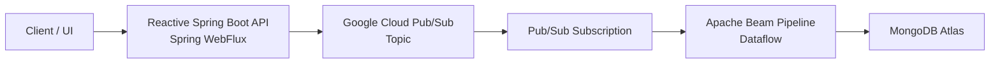
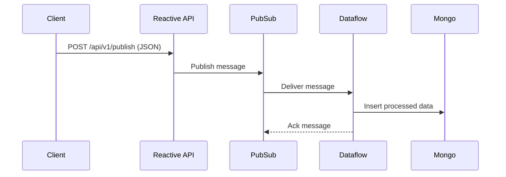

# Reactive Spring Boot API with GCP Pub/Sub & Dataflow

## Overview
- Reactive Spring Boot application using **WebFlux**
- Publishes JSON events to **Google Cloud Pub/Sub**
- Consumes messages using **reactive Flux subscriber**
- Executes processing pipelines on **Google Cloud Dataflow (Apache Beam)**
- Persists processed data into **MongoDB Atlas**
- Secured using **GCP IAM & Service Accounts**

---

## Architecture (Mermaid Diagram)



---

## Sequence Diagram



---

## Account & Access Context
- **GCP Project & Infrastructure**
  - Created using **personal Gmail account**
  - Reason: Office email lacked permission for Cloud Storage bucket creation
- **MongoDB Atlas**
  - Created using **office email ID**
- Runtime access secured via **IAM service accounts**

---

## GCP Project
- **Project ID:** `sand-480914`

---

## GCP Services
- Pub/Sub
- Dataflow (Apache Beam)
- Cloud Storage
- IAM
- Service Accounts

---

## Pub/Sub Configuration
- **Topic**
  ```
  projects/sand-480914/topics/tb-catalog-product-inbound
  ```

---

## Cloud Storage
- **Bucket:** `sand-480914-dataflow-temp`
- **Usage:** Dataflow staging & temp files

---

## Service Accounts & IAM

### Application Service Account
- `tb-catalog-product-srvc-acc@sand-480914.iam.gserviceaccount.com`
- Roles:
  - Pub/Sub Admin
  - Dataflow Admin
  - Storage Admin
  - BigQuery User

### Dataflow Worker Service Account
- `dataflow-worker-sa@sand-480914.iam.gserviceaccount.com`
- Roles:
  - Dataflow Admin
  - Dataflow Developer
  - Service Account User
  - Storage Object Admin

---

## Reactive API

### Endpoint
```
POST /api/v1/publish
```

### Example Payload
```json
{
  "productId": "P1001",
  "eventType": "CREATE",
  "price": 79999
}
```

---

## Local Run
```bash
mvn spring-boot:run
```

---

## Deployment Options
- Google Cloud Dataflow
- Google Cloud Run
- GKE
- Compute Engine

---

## Error Handling
- Ack on success
- Automatic Pub/Sub retries
- Dead Letter Topic (future)

---

## Future Enhancements
- DLT integration
- BigQuery sink
- OpenTelemetry tracing
- Micrometer metrics
- Schema validation
