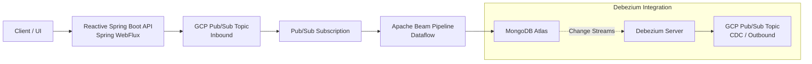
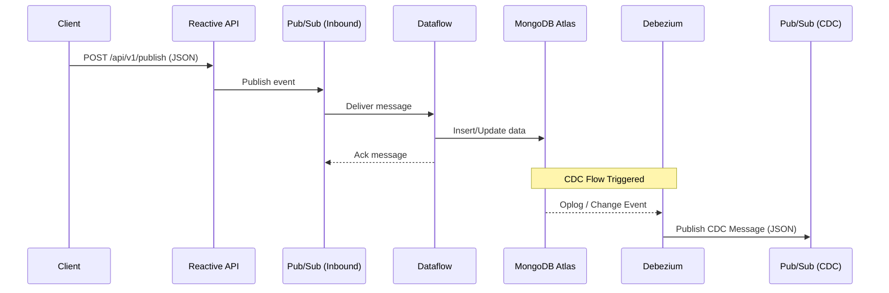

# Reactive Spring Boot API with GCP Pub/Sub & Dataflow

## Overview
- Reactive Spring Boot application using **WebFlux**
- Publishes JSON events to **Google Cloud Pub/Sub**
- Consumes messages using **reactive Flux subscriber**
- Executes processing pipelines on **Google Cloud Dataflow (Apache Beam)**
- Persists processed data into **MongoDB Atlas**
- Secured using **GCP IAM & Service Accounts**

---

## Architecture (Mermaid Diagram)



---

## Sequence Diagram



---

## Account & Access Context
- **GCP Project & Infrastructure**
  - Created using **personal Gmail account**
  - Reason: Office email lacked permission for Cloud Storage bucket creation
- **MongoDB Atlas**
  - Created using **office email ID**
- Runtime access secured via **IAM service accounts**

---

## GCP Project
- **Project ID:** `sand-480914`

---

## GCP Services
- Pub/Sub
- Dataflow (Apache Beam)
- Cloud Storage
- IAM
- Service Accounts

---

## Pub/Sub Configuration
- **Topic**
  ```
  projects/sand-480914/topics/tb-catalog-product-inbound
  ```

---

## Cloud Storage
- **Bucket:** `sand-480914-dataflow-temp`
- **Usage:** Dataflow staging & temp files

---

## Service Accounts & IAM

### Application Service Account
- `tb-catalog-product-srvc-acc@sand-480914.iam.gserviceaccount.com`
- Roles:
  - Pub/Sub Admin
  - Dataflow Admin
  - Storage Admin
  - BigQuery User

### Dataflow Worker Service Account
- `dataflow-worker-sa@sand-480914.iam.gserviceaccount.com`
- Roles:
  - Dataflow Admin
  - Dataflow Developer
  - Service Account User
  - Storage Object Admin

---

## Reactive API

### Endpoint
```
POST /api/v1/publish
```

### Example Payload
```json
{
  "eventMetadata": {
    "eventId": "tb-evt-9c72a6b4",
    "eventType": "TAILORED_BRAND_CREATED",
    "eventVersion": "1.0",
    "eventTimestamp": "2025-10-24T11:20:45.123Z",
    "sourceSystem": "TAILORED_BRANDS_CATALOG",
    "initiatedBy": "catalog-admin-ui",
    "environment": "dev"
  },

  "tailoredBrand": {
    "tailoredBrandId": "TB-900124",
    "enterpriseBrandCode": "TB-MW-001",
    "displayName": "Men’s Wearhouse",
    "legalName": "Men’s Wearhouse Inc.",
    "brandCategory": "TAILORED_APPAREL",
    "ownershipType": "PRIVATE_LABEL",

    "status": "ACTIVE",
    "isExclusive": true,
    "isCustomFitSupported": true,

    "businessPriority": 3,
    "qualityRating": 4.6,

    "lifecycle": {
      "introducedDate": "2019-04-01",
      "lastReviewedDate": "2025-10-01",
      "sunsetPlanned": false
    },

    "segments": [
      "FORMAL_WEAR",
      "BUSINESS_CASUAL",
      "CUSTOM_TAILORING"
    ],

    "supportedMarkets": [
      {
        "country": "US",
        "currency": "USD",
        "channels": ["ONLINE", "IN_STORE"]
      },
      {
        "country": "IN",
        "currency": "INR",
        "channels": ["ONLINE"]
      }
    ],

    "fitCapabilities": {
      "supportsMadeToMeasure": true,
      "supportsAlterations": true,
      "standardFitTypes": ["SLIM", "REGULAR", "ATHLETIC"]
    },

    "compliance": {
      "taxCategory": "APPAREL",
      "countryOfOrigin": "US",
      "certifications": ["ISO_9001", "ETHICAL_SOURCING"]
    },

    "localization": {
      "en_US": {
        "marketingName": "Men’s Wearhouse",
        "tagline": "You're Going to Like the Way You Look"
      },
      "es_US": {
        "marketingName": "Men’s Wearhouse",
        "tagline": "Te va a encantar cómo te ves"
      }
    },

    "digitalAssets": {
      "logo": {
        "url": "https://cdn.tb.com/brands/mw/logo.png",
        "format": "PNG"
      },
      "brandGallery": [
        {
          "assetType": "HERO_IMAGE",
          "url": "https://cdn.tb.com/brands/mw/hero.jpg",
          "resolution": "1920x1080"
        },
        {
          "assetType": "BANNER",
          "url": "https://cdn.tb.com/brands/mw/banner.jpg",
          "resolution": "1280x720"
        }
      ]
    },

    "operationalAttributes": {
      "averageAlterationTimeDays": 3,
      "storeCount": 950,
      "onlineOnlySkuPercentage": 12.5,
      "madeToOrderEnabled": true
    }
  },

  "processingContext": {
    "traceId": "trace-bd8127",
    "correlationId": "corr-112233",
    "retryCount": 0,
    "isReplay": false
  }
}

```

---

## Local Run
```bash
mvn spring-boot:run
```

---

## Deployment Options
- Google Cloud Dataflow
- Google Cloud Run
- GKE
- Compute Engine

---

## Error Handling
- Ack on success
- Automatic Pub/Sub retries
- Dead Letter Topic (future)

---

## Future Enhancements
- DLT integration
- BigQuery sink
- OpenTelemetry tracing
- Micrometer metrics
- Schema validation
